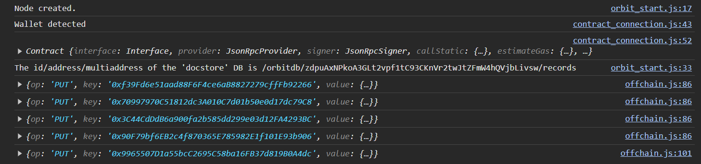

# A Practical Application for CV Verification

This app has been presented in the following paper: “_Green and Energy Efficient Blockchain: A Practical Application for CV Verification_”, submited to IEEE Access (JCR Q2 TELECOMMUNICATIONS). You can find in such paper further information on the experiments and on the proposed Dapp. If you use the code of this repository, please cite us as follows:

```
@misc{green1,
  title={Green Blockchain for CV Verification},
  author={Fernández-Blanco, Gabriel and Froíz-Míguez, Iván and Fraga-Lamas, Paula and Fernández-Caramés, Tiago M.},
  howpublished={IEEE},
  year={2024}
}
```

## Important note

This is a Proof-of-Concept (PoC), meaning that it presents a Dapp which is NOT ready for production. The code is open to future developers/researchers to improve the code and adhere to specific laws.

## Introduction

This tool illustrates how a fully-decentralized approach can tackle the academic fraud allowing to verify academic records (ARs). The app encrypts these ARs and stores their hashes in the blockchain. The verificator (anyone) can submit an AR provided by a student into the app to verify its academic merits in a fast and efficient manner. Ideally, the academic records could hold as many merits necessary to represent up to a full Curriculum Vitae (CV). However, the AR for this proof-of-concept only holds degree subjects and its marks.

### Subsystems:

- `Ethereum Network (Blockchain)`: ARs are represented by their hash code. Such a hash is stored in the blockchain, backed up by the AR present outside the blockchain (in the decentralized database). With this strategy, the size of the information stored in the blockchain is significantly reduced, but requires keeping the raw information outside the chain (off-chain). This increases transaction speed and cost savings, since operational costs decrease (i.e., the gas spent in Ethereum-based applications).

- `Decentralized Database (OrbitDB)`: This database stores the private information of teachers/professors and students (i.e., each academic record, AR), as well as their public keys. The application interacts with this database in order to login students and administrators, as well as for detecting new changes in the ARs. The information stored in OrbitDB is transparent by default, so developers have to take privacy-protection actions to protect users’ data privacy.

###  Actors:

- `Students`: Once registered, each student is able to see the constant evolution
on his AR through the periodic exams and courses. Whenever he/she wants,
he/she can download his/her AR (currently a JSON file) and share it with any
third-party, like an organization interested in hiring the student and in validating the student academic merits.

- `Teachers/Professors/Administrators`: They can be seen as permissioned teachers/professors, who are responsible for updating the ARs. For example, after
the exams, teachers/professors will register the achieved marks of the students
in the decentralized database. After such changes, the validity of these modifications needs to be approved by an administrator (e.g., by the head of the department or a person of the university/school administration). These updated
records are introduced in a ‘pending record list’ in which are stored all the new
ARs and their changes. After confirming these last changes, the validator (i.e.,
the person that approves the registered changes) will perform a transaction on
the blockchain to update the ARs. This update can be performed individually
for each AR or in batch (i.e., for several ARs at the same time) to accelerate the
process.

- `Third-party`: Any external user can verify the validity of an AR. This is simply performed by introducing the provided AR in the app, which will show
almost instantly whether the introduced AR is part of the blockchain or not (by
comparing its hash with all of the hashes stored in the blockchain).

## Requirements

The developed Dapp has been implemented using [Node](https://nodejs.org/en/download/current), [OrbitDB](https://orbitdb.org/) and [Hardhat](https://hardhat.org/hardhat-runner/docs/getting-started) as main technologies/libraries.

## Usage

1. Install dependencies executing `npm install`

2. You need to compile the `Record.sol`. You can use Remix, but Hardhat already has a more handful way to do this using scripts. More precisely, the `scripts/deploy.js` deploys the contract and gives you the contract address. Then, you will need to extract the contract ABI, which will be located in the contract artifacts (`/artifacts`).
  - `npx hardhat compile --force`
  - `npx hardhat run --network hardhat scripts/deploy.js`

3. Then, the constants present in `app/contract_connection.js` must be replaced (`CONTRACT_ADDRESS`, `CONTRACT_ABI`, `NETWORK_ADDRESS`...).

4. Now you can start the app. Open two shell windows. On the one hand execute `node server.js`. On the other hand execute `npx hardhat node --port <port>`.

5. Open `localhost:3001` in your browser. Note that some bugs can appear when using certain browsers. The console output when opening the Dapp should be like the following screenshot:


 
Where four students and one admin are introduced in OrbitDB. Note that the first four users are students and the last one is admin, so use the accounts in your wallet accordingly. The OrbitDB data will not persist if the page is refreshed. To change between accounts, use the Logout button.

## Demo

### 1. Student

The first time the student registers in the application, he needs to create a new transaction that will encrypt his AR in the blockchain (i. e.: store the AR hash). After the transaction was successfully sent, the Dapp will display the AR of the student. Note that at this point there will be subjects pending to be evaluated.


### 2. Admin

Once the admin is successfully logged, the Dapp will display the pending record list, if there are any AR pending to be confirmed (tipically after the exams period). After checking all of them, the admin will confirm these changes.


### 3. Student

Now the student has his/her AR updated. The AR download can be done anytime, so the student can share it with anybody (tipically a Third Party).


### 4. Third Party
The aforementioned AR can be verified by everyone by simply introducing it in the corresponding field.


## Funding

This development has been funded by grant TED2021-129433A-C22 (HELENE) funded by MCIN and AEI (10.13039/501100011033) and by the European Union NextGenerationEU/ PRTR.

## License
Shield: [![CC BY 4.0][cc-by-shield]][cc-by]

This work is licensed under a
[Creative Commons Attribution 4.0 International License][cc-by].

[![CC BY 4.0][cc-by-image]][cc-by]

[cc-by]: http://creativecommons.org/licenses/by/4.0/
[cc-by-image]: https://i.creativecommons.org/l/by/4.0/88x31.png
[cc-by-shield]: https://img.shields.io/badge/License-CC%20BY%204.0-lightgrey.svg
